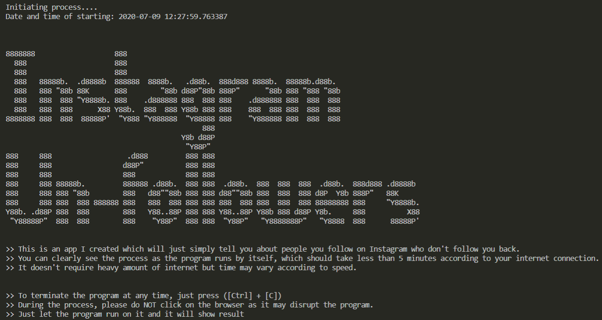

# Insta-unfollowers

This is a python script I created which will just simply tell you about people you follow on Instagram who don't follow you back.
It doesn't require heavy amount of internet but time may vary according to speed.
During the process, please do NOT click on the browser as it may disrupt the program.
Just let the program run on it and it will show result

The only required packages are Selenium and webdriver-manager.
Please feel free to raise a PR if you encounter some error or problem.

Also a [link](https://drive.google.com/file/d/1Eh3XfEFKbKw_LoQYulDpq7rcEoU1Cn6g/view?usp=sharing) if you want to download an .exe file and run it on your Windows device.

Note*-> You do need Chrome already installed for the .exe file to run.
